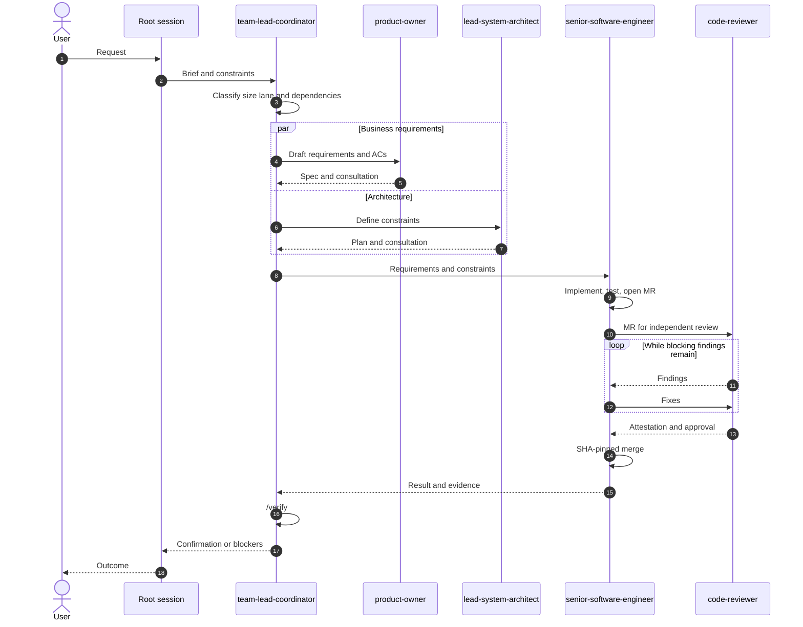

# AI Agents Team


A reusable, cross-runtime agent-team configuration for Claude Code, Codex, and
OpenCode. It defines six delivery roles plus a standalone organic-search
agent. There is no application, build, or project-specific `specs/`
directory here.

This repo is also a Claude Code plugin (and its own single-plugin
marketplace) — see [Installing as a Claude Code plugin](#installing-as-a-claude-code-plugin)
below. The same `.claude-plugin/marketplace.json` is natively recognized by
Codex's own plugin system too — see [Installing as a Codex plugin](#installing-as-a-codex-plugin).

Several agent/skill files reference example values like `<your-org>`,
`@your-agent-bot`, or `project-a` where they describe *your own* GitLab
group, bot account, or infrastructure repos — replace those with your real
values after installing; they are placeholders, not live endpoints.

## Delivery team

| Role | Responsibility |
| --- | --- |
| `team-lead-coordinator` | Coordinates, delegates, sequences, and verifies; never performs specialist work. |
| `product-owner` | Owns requirements, acceptance criteria, scope, and priorities. |
| `lead-system-architect` | Owns architecture, governing plans, contracts, and non-functional requirements. |
| `senior-software-engineer` | Implements and tests application code; authors and merges, never reviews. |
| `code-reviewer` | Independently reviews M/L application governing-document MRs and application-code MRs; never authors or merges. |
| `devops-infra-expert` | Owns infrastructure, Kubernetes, CI/CD, deployment, and operational reliability. |

The standalone `seo-specialist` agent supports organic search and AI-answer
visibility work. It does not replace the delivery-team roles.

### How a change flows through the team

The path of an application-code change, from request to `/verify`:



The coordinator delegates and sequences; it never does specialist work itself.
The engineer always consults the architect and product owner before
implementation. Author and reviewer are always separate agent instances,
recorded in a `REVIEW-ATTESTATION`: reviewer identity, the exact SHA reviewed,
files reviewed, findings, and verdict.

Infrastructure and Kubernetes-manifest changes follow the same shape with a
domain-specific reviewer: `devops-infra-expert` (author) →
`devops-infra-expert` (a second, independent instance) → `devops-infra-expert`
(author merges the reviewed SHA) — never `code-reviewer`, which only reviews
application code.

## Spec-driven delivery

Target projects use the repository's GitHub SpecKit-style workflow:
`/specify` → `/plan` → `/tasks` → `/implement` → `/review` → `/merge` →
`/verify` → `/archive`.

Work is assigned the lightest XS/S/M/L lane allowed by its actual surface:

- XS: documentation, comments, or a bugfix with no behavior change.
- S: contained presentation, copy, styling, tuned values, or bugfixes with no
  contract, data, infrastructure, auth, money, legal, or multi-artifact impact.
- M: new behavior inside existing contracts in one deployed artifact.
- L: contracts, persisted data, infrastructure topology, auth/secrets, money,
  legal/GDPR surface, or a second deployed artifact.

`/verify` is the only path to done. It appends an evidence-backed entry to the
target project's `specs/verify-log.md`; closure entries and archive moves are
batched into a reviewed Tier-0 MR. Detailed rules live in `AGENTS.md` and the
`sdd-workflow` skill.

Before implementation, `tasks.md` maps every acceptance criterion to its check,
stage, evidence, and owner. Lane M/L governing documents receive one bounded
assumption challenge in their existing review, and failed gates feed a compact
record used to decide whether the harness needs code, clearer instructions, or
no change.

## Installing as a Claude Code plugin

This repository is a single-plugin [Claude Code marketplace](https://docs.claude.com/en/docs/claude-code/plugins). Add it and install the plugin:

```
/plugin marketplace add uprinter/ai-agents-team
/plugin install ai-agents-team@ai-agents-team
```

This makes the seven agents and every shared skill available in any project
without copying files. `claude plugin details ai-agents-team@ai-agents-team`
after install shows the full component inventory and its projected token
cost.

## Installing as a Codex plugin

Codex's own plugin loader reads the same `.claude-plugin/marketplace.json` —
no separate `.codex-plugin/` manifest needed:

```
codex plugin marketplace add uprinter/ai-agents-team
codex plugin add ai-agents-team@ai-agents-team
```

This installs the plugin's `skills` (declared in `.claude-plugin/plugin.json`)
into Codex. Codex's plugin manifest schema has no concept of custom
sub-agents (only `skills`, `mcpServers`, `apps`, and `hooks`), so the seven
agents don't come through this path; they're covered separately below.

Both installers copy the plugin's files rather than following symlinks, which
is why `agents/` and `.claude/skills/` — the paths the plugin manifest and
Claude Code's own default discovery point at — hold the *real* directories
(verified by installing and inspecting each tool's local plugin cache, not
just by reading their docs). `.claude/agents/` and `.agents/skills/` are
symlinks kept for the runtime layout below.

## Runtime layout

```text
agents/                source agent prompts for all runtimes (symlinked as .claude/agents/)
.claude/process/       shared process references and provenance
.claude/skills/        real skill directories, shared across runtimes (symlinked as .agents/skills/)
.codex/agents/         generated project-scoped Codex custom agents
.codex/sync-agents.py  Codex generator and drift validator
.opencode/agent/       generated OpenCode agents
.opencode/sync-agents.py
.claude-plugin/        Claude Code plugin + marketplace manifests (also read by Codex's plugin loader)
AGENTS.md              canonical repository instructions
```

## Using Codex's own custom-agent discovery

Separately from the plugin install above, Codex has its own project-scoped
custom-agent mechanism, unrelated to its plugin system: open Codex directly
in a checkout of this repository and it automatically discovers standalone
custom agent TOMLs from `.codex/agents/`; no absolute `config_file` entries in
`~/.codex/config.toml` are needed. Multi-agent support and `agents.enabled` are
enabled by default unless the user has explicitly disabled them.

Ask Codex to spawn a named specialist for a bounded task, or use
`team-lead-coordinator` for multi-role delivery work. The coordinator uses
Codex's collaboration tools and project-discovered agent names.

## Editing and validation

Edit `agents/*.md` (symlinked as `.claude/agents/*.md`), then regenerate both ports:

```sh
.opencode/sync-agents.py
.codex/sync-agents.py
.codex/sync-agents.py --check
```

The Codex check validates freshly rendered TOML, requires `name`, `description`,
and `developer_instructions`, byte-compares it with generated profiles, and
fails on drift, missing source coverage, or unexpected output.

Validate the current S/M/L feature in a target project with the optional harness
checker:

```sh
python3 .claude/scripts/check_harness.py --target-root /path/to/project --feature NNN-slug
```

Target CI should call this feature-scoped command for enforcement. Omitting
`--feature` scans historical active specs and the verify log; XS is not covered
because it has no universal artifact location.

This team has no per-agent memory directory. Durable learnings belong in
target-project conventions, target-project ADRs, or the shared process and
role artifacts described in `AGENTS.md` — most visibly as dated entries in
`.claude/process/rule-provenance.md`.

## Third-party skills

A few skills under `.claude/skills/` (and their `.agents/skills/` symlinks)
are vendored from other authors, tracked in `skills-lock.json`:
`frontend-design` (anthropics/skills), `hallmark` (nutlope/hallmark), and
`web-design-guidelines` (vercel-labs/agent-skills). Their own licenses apply
to those files; see each skill's directory.

## License

MIT — see [LICENSE](LICENSE). Third-party skills listed above keep their
own upstream licenses.
